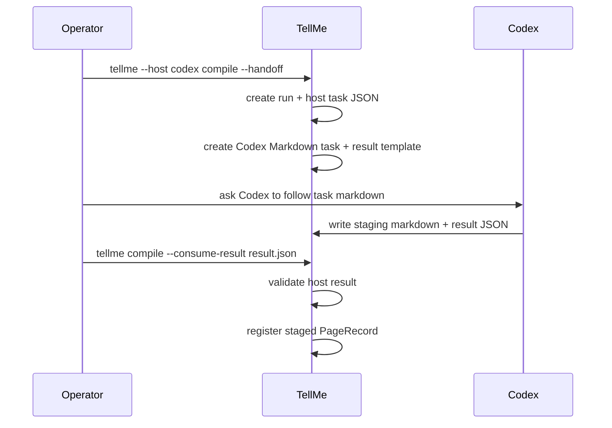

# Codex Collaboration Design

## Human Review Summary

- What We Are Building:
  - A minimal closed-loop collaboration path between TellMe and Codex.
- Why This Design:
  - The current implementation records `--host codex` and writes JSON task packets, but Codex still lacks a practical human-readable task handoff and TellMe lacks a safe way to consume Codex output back into state.
- Operator Interaction:
  - The operator runs `tellme compile --handoff --host codex`, asks Codex to follow the generated Markdown task, then runs `tellme compile --consume-result <result.json>` to register Codex output.

## Scope

In scope:

- Generate Codex-readable Markdown task files next to host task JSON.
- Generate a result template for Codex to fill.
- Consume Codex `HostResult` JSON into TellMe state as a staged page.
- Enforce safety boundaries: Codex output may be registered from `staging/` only in this MVP slice.

Out of scope:

- Automatically invoking Codex CLI.
- Trusting Codex output as published content.
- Merging Codex output into `vault/` automatically.
- Provider/model API integration.

## Requirements Trace

- R2. Codex must be a first-class host entry point.
- R3. Obsidian remains display-only; staged Codex output is not canonical until TellMe records it.
- R6. High-risk generated content stages first.
- R7. Host work must be auditable through `runs/` and state.

## Codex Collaboration Flow

## Interfaces

### Handoff

`tellme compile --handoff --host codex` creates:

- `runs/<run-id>/host-tasks/compile-codex.json`
- `runs/<run-id>/host-tasks/compile-codex.md`
- `runs/<run-id>/artifacts/codex-result.template.json`

The Markdown task must be readable by Codex without chat context and must include:

- command and run id
- allowed read roots
- allowed write roots
- input source paths
- expected result JSON path
- safety rules

### Consume Result

`tellme compile --consume-result <path>`:

- validates host result schema
- requires `host == codex`
- requires output path to stay under `staging/`
- requires output markdown file to exist
- upserts a staged `PageRecord`
- does not publish to `vault/`

## Failure Handling

| Failure | Behavior |
|---|---|
| Result JSON invalid | command fails, run diagnostics record validation error |
| Output path outside staging | command fails and does not mutate page state |
| Output file missing | command fails and does not mutate page state |
| Missing source references | existing host result validation fails |

## Design Decision

Codex collaboration is implemented as compile-mode handoff/consume behavior because compile is the first command that needs host-assisted synthesis. This preserves the six-command MVP surface while making Codex collaboration operational.
