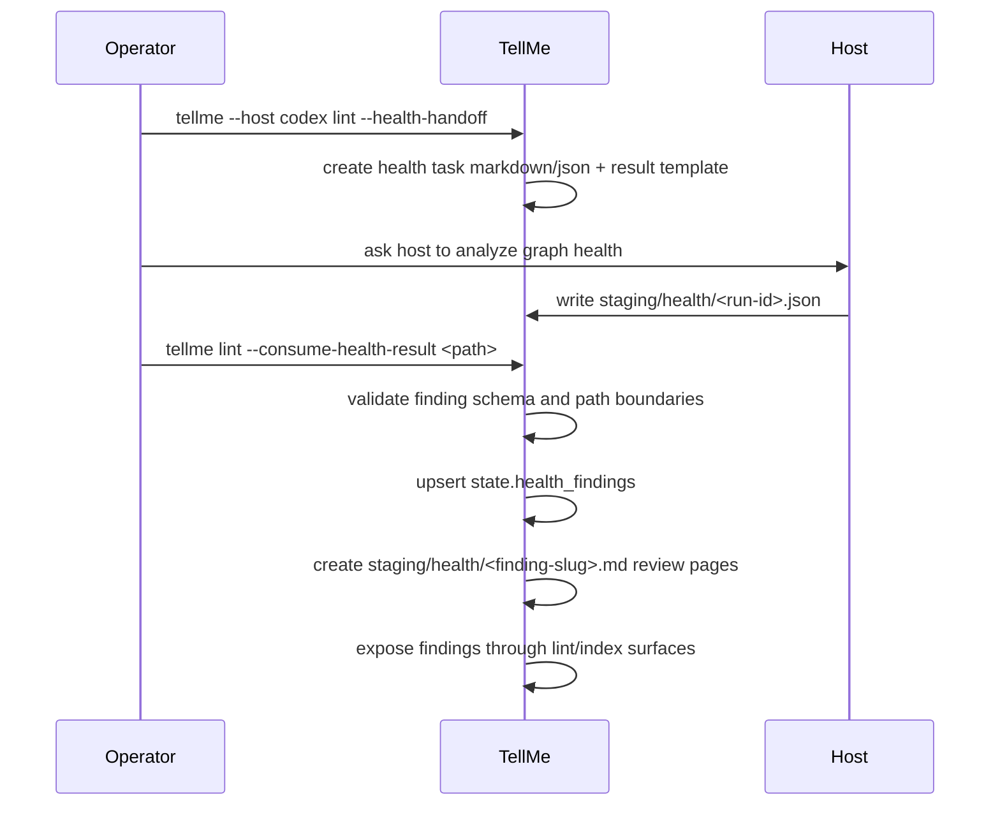

# Health Reflection Consumption Design

## Human Review Summary

- What We Are Building:
  - A bounded TellMe health/reflection loop that can consume host-generated health findings, project them into staged review surfaces, and expose actionable follow-up signals without auto-mutating the graph.
- Why This Design:
  - TellMe already generates `lint --health-handoff` tasks, but health results still terminate as isolated JSON. That breaks the intended Karpathy-style feedback loop where graph health work should accumulate back into the wiki workflow.
- Operator Interaction:
  - The operator runs `tellme lint --health-handoff`, asks a host to write `staging/health/<run-id>.json`, then runs `tellme lint --consume-health-result <path>` so TellMe can validate, stage, and expose the findings.

## Scope

In scope:

- A safe consume path for host-written health result JSON under `staging/health/`.
- Validation and state registration into `state.health_findings`.
- Staged Markdown review pages for each health finding.
- Deterministic health-routing metadata so findings become actionable review work instead of dead artifacts.
- Lint and index visibility for staged health findings.
- README and host-contract updates for the new loop.

Out of scope:

- Automatic host CLI invocation.
- Automatic graph candidate generation from findings.
- Direct publish of health findings into `vault/`.
- Automatic conflict resolution or graph edits.

## Requirements Trace

- `docs/designs/2026-04-10-karpathy-llm-wiki-design-update.md`
  - Health checks should continuously improve wiki integrity.
  - Health outputs must remain staged until reviewed.
- `docs/designs/2026-04-10-knowledge-graph-mvp-redesign.md`
  - TellMe remains the control plane and validates host outputs.
  - Hosts may not mutate `raw/` or publish directly to `vault/`.
- `AGENTS.md`
  - Formal operations must be auditable through `runs/`.
  - Reviewable work should surface in `staging/`.

## Health Reflection Flow

## Interfaces

### Handoff

Existing behavior stays:

- `tellme lint --health-handoff` creates the health task and result template.

The result JSON remains under:

- `staging/health/<run-id>.json`

Each finding must include:

- `id`
- `finding_type`
- `summary`
- `affected_ids`
- `sources`
- `recommendation`
- `confidence`

### Consume Result

New behavior:

- `tellme lint --consume-health-result <path>`

The consume path must:

- require the result file to remain under `staging/health/`
- validate schema and required fields
- reject findings whose `sources` fall outside registered sources
- register normalized findings into `state.health_findings`
- generate per-finding staged Markdown review pages
- record `status`, `last_host`, `last_run_id`, and `staged_path`

## Review Surface

Each consumed finding gets a staged page under:

- `staging/health/<finding-slug>.md`

The page should include:

- frontmatter with `page_type: health_finding`
- `finding_id`
- `finding_type`
- `status: staged`
- `sources`
- `affected_ids`
- `confidence`
- `suggested_next_action`

Body sections should make review practical:

- summary
- recommendation
- affected records
- evidence sources

## Action Routing

TellMe should not auto-convert a health finding into a graph change in this slice. Instead it should classify and expose the next expected action.

Initial routing classes:

- `thin_node` -> `enrich_node`
- `missing_node` -> `create_node_candidate`
- `weak_link` -> `propose_relation`
- `duplicate_concept` -> `review_duplicate`
- `conflict_followup` -> `review_conflict`
- unknown types -> `manual_review`

This keeps the loop actionable without bypassing the existing staged review boundary.

## Exposure Surfaces

Deterministic visibility should exist in two places:

- `lint`
  - report malformed or dangling staged health findings
  - report affected ids that do not exist in current graph state
- `vault/indexes/health-review.md`
  - show the staged health review queue from state

`vault/index.md` should link to the health review index so Obsidian becomes the working surface for these findings.

## Failure Handling

| Failure | Behavior |
|---|---|
| Health JSON outside `staging/health/` | command fails and does not mutate state |
| Missing required finding fields | command fails and does not mutate state |
| Sources not registered | command fails and does not mutate state |
| Affected ids missing from state | finding may be staged, but lint reports it for review |
| Unknown finding type | finding stages with `suggested_next_action: manual_review` |

## Design Decision

Health reflection stays under the `lint` command surface for now. This keeps the TellMe command set compact, preserves the current `--health-handoff` mental model, and lets us add a symmetric consume path without inventing a separate command before the workflow justifies it.
