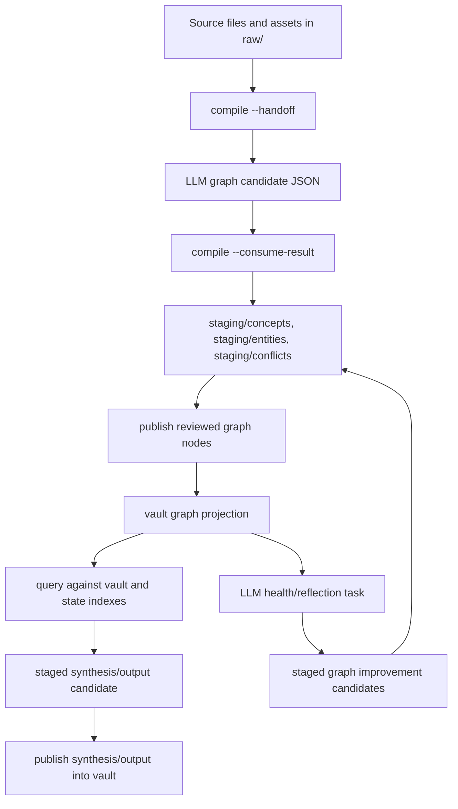

# Karpathy-Informed LLM-Wiki Design Update

## Design Goals

Karpathy's LLM-wiki note reinforces TellMe's graph-first direction, but it raises the product bar in three ways:

1. Obsidian should become the working IDE for raw evidence, compiled graph pages, staged review surfaces, and generated outputs.
2. Query and exploration outputs should be filed back into the wiki so the knowledge base accumulates over time.
3. LLM health checks should actively improve wiki integrity by finding missing knowledge, contradictions, weak links, and useful new article candidates.

The updated design goal is:

```text
raw evidence + assets
-> LLM graph extraction
-> staged graph updates
-> reviewed vault projection
-> queries and outputs
-> synthesis candidates
-> health/reflection candidates
-> richer vault projection
```

## Requirements Trace

| Requirement | Source | Design Response |
|---|---|---|
| Raw documents are evidence, not the final wiki | Existing TellMe redesign, Karpathy ingest section | Keep `raw/` immutable and keep wiki pages as derived graph projection |
| LLM maintains the wiki | Karpathy IDE section | Host tasks should ask LLMs to maintain concepts, links, indexes, and outputs under TellMe guardrails |
| Obsidian is the IDE frontend | Karpathy IDE/output sections | Add vault index pages and review/output surfaces, not only isolated concept pages |
| Q&A outputs should add up | Karpathy output section | Query outputs become synthesis candidates that can be published |
| Health checks improve integrity | Karpathy linting section | Add LLM-assisted reflection candidates alongside deterministic lint |
| Avoid premature heavy RAG | Karpathy Q&A section | Prefer state indexes, markdown summaries, and search CLI before vector DB |

## User And System Flow



## State And Content Model Updates

TellMe already has `nodes`, `claims`, `relations`, and `conflicts` in `state/manifest.json`. The Karpathy-informed loop needs these additional state units:

| Unit | Purpose | Initial Projection |
|---|---|---|
| `outputs` | Durable query/analysis artifacts that may be filed back into the wiki | `staging/outputs/` and `vault/outputs/` |
| `syntheses` | Higher-level conclusions produced from multiple graph nodes or queries | `staging/synthesis/` and `vault/synthesis/` |
| `indexes` | Obsidian-readable navigation surfaces generated from state | `vault/index.md`, `vault/indexes/*.md` |
| `health_findings` | LLM or deterministic findings about gaps, contradictions, duplicates, or weak links | `staging/health/` |
| `assets` | Local non-text evidence associated with sources | future `raw/assets/` or source bundles |

The initial implementation should avoid a new database. These units can live in the existing JSON manifest until scale forces a stronger storage layer.

## Interface Decisions

The command surface should stay small:

- `query --stage` should evolve from a plain answer draft into a synthesis/output candidate producer.
- `publish --path` and `publish --all` should support `synthesis` and `output` pages, not only graph node pages.
- `compile --handoff` remains the graph extraction entry point.
- A future `lint --health-handoff` or `reflect` mode should produce LLM health tasks without adding a new top-level command yet.

The host-facing packet should include:

- relevant graph node summaries
- index pages or index snippets
- source references
- expected output schema
- explicit instruction that useful outputs should be fileable back into the wiki

## Obsidian IDE Surface

The vault should include generated navigation and review pages:

- `vault/index.md`: entry page with links to concepts, entities, synthesis pages, outputs, and unresolved conflicts.
- `vault/indexes/concepts.md`: concept directory from state.
- `vault/indexes/entities.md`: entity directory from state.
- `vault/indexes/synthesis.md`: higher-level filed query outputs.
- `vault/indexes/unresolved-conflicts.md`: review queue backed by staged conflicts or published conflict summaries.

These pages are derived outputs. They should be regenerated safely from state and should not become the primary state store.

## Failure Handling

- If a query output lacks sources, it must remain a run artifact and cannot become a synthesis candidate.
- If a staged synthesis references missing graph nodes, lint should report it before publish.
- If an index page is manually edited, reconcile should either preserve the manual page as drift or regenerate it with a clear policy.
- If health/reflection produces speculative findings, they must remain staged until reviewed.

## Non-Goals

- No heavy vector database in this phase.
- No automatic web research in deterministic commands.
- No direct LLM writes to `vault/`.
- No automatic conflict resolution without review.
- No image processing implementation yet; only reserve the design path for source assets.

## Human Review Summary

This update does not replace the graph candidate architecture. It extends it with Karpathy's strongest product loop: LLM queries and health checks should continuously improve the markdown wiki. The immediate next implementation should make query outputs fileable as synthesis candidates, publish those candidates into `vault/synthesis/`, and generate basic Obsidian index pages from state.

## Unresolved Design Questions

- Whether `reflect` should be a `lint` mode, a `compile` mode, or a new command after the next MVP slice.
- Whether `outputs` and `syntheses` should be separate long term, or whether `synthesis` should be a subtype of output.
- How much manual review UX belongs in CLI versus Obsidian pages.
