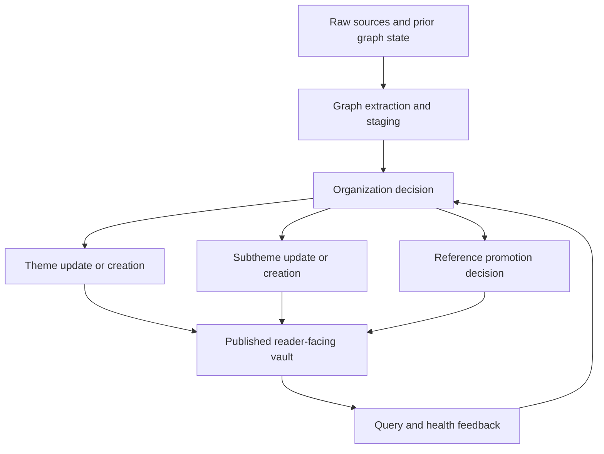
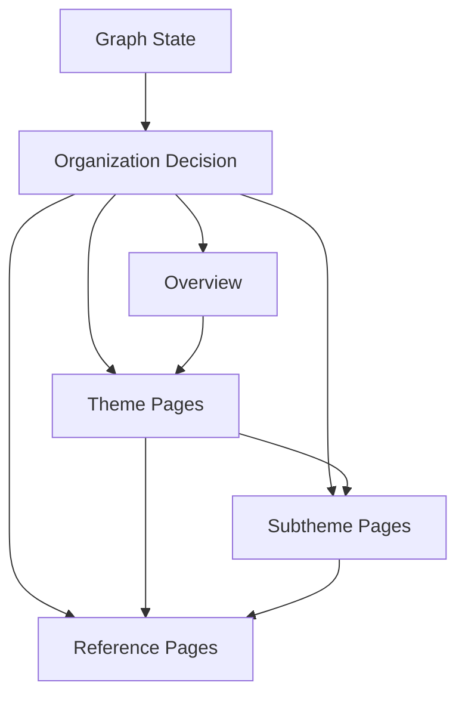

# Reader-Facing Knowledge Organization Redesign

## Human Review Summary

- What We Are Building:
  - A reader-facing TellMe vault that is organized around chapter-like themes and subthemes instead of exposing concept and entity cards as the primary reading experience.
- Why This Design:
  - TellMe's current graph-first publish model produces structurally valid pages, but the resulting vault is hard to browse, hard to understand, and weak at guiding readers through the knowledge base.
- Human Approval Needed For:
  - The new reading-layer information architecture, the promotion rules for independent reference pages, and the migration strategy away from concept/entity pages as the default primary output.

## Problem Frame

TellMe currently treats `concept` and `entity` pages as the default published knowledge unit. This matches the internal graph model, but it does not match how a human wants to read and understand a knowledge base. Readers need a clear entry point, a topic structure, an explanation-first narrative, and a limited number of stable reference pages. Without that organization layer, the vault feels like a pile of extracted knowledge fragments rather than a coherent wiki.

The redesign keeps TellMe's internal graph/state control plane while changing the reader-facing product shape. Graph state remains the system truth. The vault becomes a curated reading layer with explicit themes, subthemes, and only a small number of promoted reference pages.

## Design Scope

- Owner Mode: product-led
- Design Focus:
  - define the new information architecture for published knowledge
  - define page roles and reading flow
  - define promotion thresholds for independent reference pages
  - define how TellMe publishes from graph state into reader-facing pages
  - define migration behavior for the existing concept/entity-heavy vault shape

## Design Goals

- Make the default reading experience understandable without requiring readers to mentally reconstruct the graph.
- Make the vault feel like a chaptered knowledge product rather than a bag of extracted notes.
- Preserve TellMe's graph/state model as the authoring and validation substrate.
- Reduce low-value independent pages by requiring explicit promotion thresholds.
- Keep query and health feedback loops compatible with the new reading-layer structure.

## Requirements Trace

- R1. The primary reading experience should be organized by theme rather than by low-level page type.
- R2. The reading structure should be two levels deep: `theme -> subtheme`.
- R3. Theme pages should be chapter-like and readable end-to-end, not just navigation indexes.
- R4. Theme pages should balance explanation and evidence: first make the topic understandable, then expose key evidence and sources.
- R5. `concept/entity` pages should exist only when they are important enough to be independent reference pages.
- R6. Migration should be strong rather than conservative: existing concept/entity pages are not automatically preserved as reader-facing primary pages.
- R7. TellMe must keep graph/state as the internal source of truth and not collapse back into uncontrolled manual wiki pages.

## Flow

Reader-facing publication should work like this:

The key change is the new `organization decision` layer. TellMe should no longer publish graph nodes directly as the default reader-facing pages. Instead, it should decide whether new material:

- enriches an existing theme
- belongs inside an existing subtheme
- requires a new theme
- requires a new subtheme
- deserves promotion into an independent reference page

## Interaction Model

| Actor | Action | System Response | Notes |
|---|---|---|---|
| Reader | Opens the vault for the first time | Sees `overview.md` with major themes and recommended reading order | The first screen should orient, not overwhelm |
| Reader | Opens a theme page | Reads a chapter-style explanation with linked subthemes, references, and evidence | Theme pages are meant to be readable directly |
| Reader | Needs more detail on one branch | Follows a link into a subtheme page | Subthemes narrow scope without collapsing into glossary pages |
| Reader | Needs a precise definition or stable object page | Follows a link into a reference page | Reference pages are secondary, not primary entry points |
| Operator / Host | Ingests new material | TellMe updates graph state, then maps knowledge into themes/subthemes/references | Publication is organization-aware |
| Operator / Host | Reviews health/query feedback | Feedback is routed toward theme/subtheme enrichment first, reference promotion second | Prevents runaway page fragmentation |

## States And Failure Handling

| State | Trigger | User / Operator Visible Behavior | Recovery Or Next Step |
|---|---|---|---|
| Empty | New project or no published knowledge | `overview.md` shows an empty but guided scaffold with expected theme slots | Ingest sources and build initial themes |
| Organized | Themes and subthemes exist | Readers browse by topic, not by raw graph fragments | Normal operating state |
| Under-structured | New material does not fit an existing theme cleanly | Staged review prompts operator to create or split a theme/subtheme | Human review before publish |
| Over-fragmented | Too many small concepts/entities would become standalone pages | TellMe routes them into theme/subtheme content instead of publishing them directly | Promotion threshold prevents clutter |
| Ambiguous promotion | A concept/entity may deserve its own page but evidence is weak | Keep as embedded theme/subtheme material until thresholds are met | Re-evaluate later via query/health feedback |
| Theme overload | A theme becomes too long or too heterogeneous | Suggest subtheme split during staged review or health reflection | Structural maintenance loop |

## Interfaces And Boundaries

| Surface Or Component | Responsibility | Explicit Non-Responsibility |
|---|---|---|
| `state/` graph model | Track nodes, claims, relations, conflicts, and feedback artifacts | Not the reader-facing final presentation |
| Organization decision layer | Decide how graph content maps into themes, subthemes, and references | Not responsible for raw extraction correctness |
| `vault/overview.md` | Orient readers, summarize themes, recommend reading paths | Not a full dump of all page links |
| `vault/themes/*.md` | Deliver chapter-like understanding of a major topic | Not a glossary or exhaustive node list |
| `vault/subthemes/*.md` | Explain a stable branch within a theme | Not a substitute for full-theme orientation |
| `vault/references/*.md` | Provide precise definitions or object pages for promoted items | Not the primary reading path |
| `vault/indexes/*.md` | Maintenance-oriented indexes and alternate navigation surfaces | Not the primary reader-facing product layer |

## Key Design Decisions

- Theme-first organization:
  - The reader-facing vault should be organized around themes, not around raw graph node types.
- Two-level topic hierarchy:
  - Theme and subtheme are enough for the current TellMe scope. Deeper hierarchies would add structure before we know the real topic density.
- Chapter-style theme pages:
  - Theme pages should explain the topic in narrative form, not act as pure navigation indexes.
- Balanced content model:
  - Theme pages should first explain the topic, then show key evidence, references, and unresolved questions.
- Reference pages as promoted outputs:
  - `concept/entity` pages should become promoted reference pages, not default outputs.
- Strong migration:
  - Existing concept/entity pages should be treated as source material for reorganization unless they clearly satisfy the promotion threshold.
- Graph stays underneath:
  - TellMe's graph/state layer remains the authoring substrate and validation boundary. The redesign changes publication shape, not the internal truth model.

## Theme, Subtheme, And Reference Roles

### Overview

`overview.md` should answer:

- what this knowledge base currently covers
- which themes matter most
- what reading order a new reader should follow
- where the current gaps or weak areas are

It is a map, not a raw index.

### Theme Pages

Theme pages are the main product unit. Each should normally contain:

1. a short summary
2. the core question or problem the theme addresses
3. the main explanatory narrative
4. links to child subthemes
5. links to important reference pages
6. key evidence and sources
7. unresolved questions or tensions

### Subtheme Pages

Subtheme pages should exist when a branch of a theme is:

- important enough to deserve its own focused explanation
- stable enough to be revisited over time
- too large or too conceptually distinct to stay inside the parent theme body

Subtheme pages should narrow scope, not repeat the entire theme.

### Reference Pages

Reference pages are promoted pages. They should exist only when a concept/entity:

- is supported by multiple sources
- is referenced by multiple theme/subtheme pages
- has stable definitional value
- is likely to be directly searched or cited
- remains useful outside one local theme context

If those conditions are not met, the item should remain embedded in theme/subtheme content.

## Publication Rules

TellMe's reader-facing publication should follow these defaults:

- New graph material first attempts to enrich an existing theme.
- If the material is coherent but too large or too distinct, it creates or enriches a subtheme.
- Independent reference pages are opt-in via promotion thresholds, not the default.
- Health/query feedback should primarily improve themes and subthemes rather than generate more standalone pages.
- Maintenance indexes may still expose `concepts`, `entities`, or graph views, but those indexes should not define the primary reading experience.

## Migration Strategy

This redesign assumes strong migration rather than soft compatibility.

Migration defaults:

- Existing `concept/entity` pages are not automatically preserved as first-class reading pages.
- Existing pages should be classified into:
  - promoted reference page
  - absorbed into a theme
  - absorbed into a subtheme
  - archived as low-value intermediate output
- Existing `vault/indexes/concepts.md` and related pages remain useful for maintenance, but they move into a secondary support role.
- New theme and subtheme layers become the canonical reading path.

## Operational Considerations

- This redesign introduces an explicit organization decision stage between graph extraction and final publish.
- Query and health loops should continue to operate, but their outputs should preferentially target theme/subtheme enrichment.
- Theme bloat and subtheme sprawl should become first-class health-check concerns.
- Promotion thresholds must stay conservative; otherwise the system will drift back toward concept-card sprawl.
- Manual editing in `vault/` should continue to reconcile, but reconciliation must respect the new page roles.

## Human Review Checklist

- The intended behavior is understandable without chat context: yes
- User/operator interactions are explicit: yes
- Important states and failures are explicit: yes
- Boundaries and non-goals are explicit: yes
- Remaining decisions are listed in the right section: yes
- Diagrams/tables are used where they materially improve reviewability: yes

## Open Questions

### Resolve Before Planning

- none

### Deferred To Planning

- How to represent `theme` and `subtheme` in state: as new first-class records, as specialized node kinds, or as publish-only abstractions over existing graph state.
- Whether `overview.md` should live at `vault/index.md` or coexist with `vault/index.md` as separate surfaces.
- How aggressively to preserve backward links from old concept/entity URLs to newly organized theme/subtheme pages.

## Design Quality Gate

- Flow clarity: strong
- State completeness: strong
- Boundary clarity: strong
- User or operator clarity: strong
- Operability realism: strong
- Ambiguity left for implementer: acceptable

## Challenge Decision

- Challenge Mode: design
- Human approval readiness: ready_for_human_approval
- Must fix before human design approval: none
- Challenge Summary Path: pending
- Challenge Disposition Path: pending

## Next Step

- `cmon:challenge(mode=design)` before human approval
- `human_design_approval` after challenge passes
- `cmon:plan` only after human design approval
- resume `cmon:design` when design blockers remain
