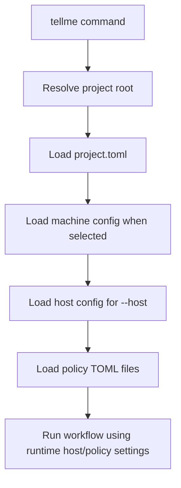

# Runtime Policy And Lint Design

## Human Review Summary

- What We Are Building:
  - The next TellMe capability slice after MVP workflow usability: host and policy config become real runtime inputs, and static lint becomes a stronger local safety gate.
- Why This Design:
  - The gap document identifies shallow config loading and incomplete static lint as the highest-value non-LLM gaps. Fixing them makes later LLM-assisted compile/query safer without prematurely integrating model providers.
- Operator Interaction:
  - Operators keep using `--host`, `--project`, and the six existing commands. Project defaults are created by `tellme init`; advanced behavior is adjusted by editing TOML config files.

## Scope

In scope:

- Create default `config/hosts/{claude-code,codex,opencode}.toml` during `init`.
- Create default policy files under `config/policies/`.
- Load selected host config and policy config into `ProjectRuntime`.
- Let `compile` honor a publish policy for source summary pages.
- Let `lint` detect known page hash drift and orphaned running runs.

Out of scope:

- Calling Claude Code, Codex, or OpenCode CLIs.
- Direct provider SDK integration.
- Vector search, semantic contradiction detection, or LLM lint.
- Full conflict merge generation in `reconcile`.

## Requirements Trace

- R1. PC/Mac operation needs machine and project-local config.
- R2. Claude Code, Codex, and OpenCode must be explicit host entry points.
- R3. Obsidian remains display-only; `state/` and `runs/` stay authoritative.
- R6. Publish policy must control whether content goes directly to `vault/` or first to `staging/`.
- R7. System state and operation history must be explicit and reviewable.

## Flow

## Runtime Interfaces

| Runtime Field | Source | Use |
|---|---|---|
| `host` | `config/hosts/<host>.toml` | Host identity, preferred model label, command profile |
| `policies` | `config/policies/*.toml` | Compile publish behavior and lint behavior |
| `machine` | `config/machines/*.toml` | Cross-platform path overrides |

## Policy Behavior

`config/policies/publish.toml` contains:

- `source_summary_direct_publish = true` by default.

When true, deterministic source summaries go to `vault/sources/`.
When false, source summaries go to `staging/sources/` and are recorded as staged pages.

`config/policies/lint.toml` contains:

- `check_page_hash_drift = true`
- `check_running_runs = true`

These checks are deterministic and do not require LLMs.

## Lint Behavior

Static lint should report:

- Missing frontmatter.
- Missing source references.
- Broken wikilinks.
- Page hash drift for known published/staged pages in state.
- Running runs left behind in `runs/`.

Hash drift is warning-level because it may represent a valid human edit that should be absorbed through `reconcile`.
Running runs are warning-level because interruption is recoverable but should be visible.

## Design Decision

This slice keeps TellMe file-backed and host-agnostic. It turns existing config directories from placeholders into active runtime inputs, while preserving the rule that host output remains non-canonical until TellMe consumes it.
