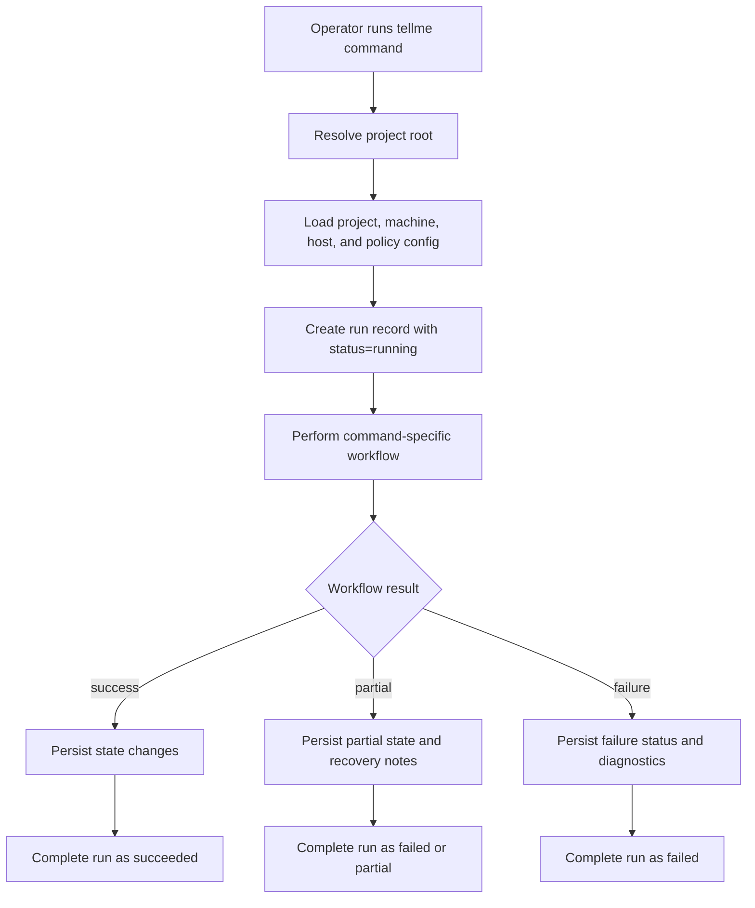
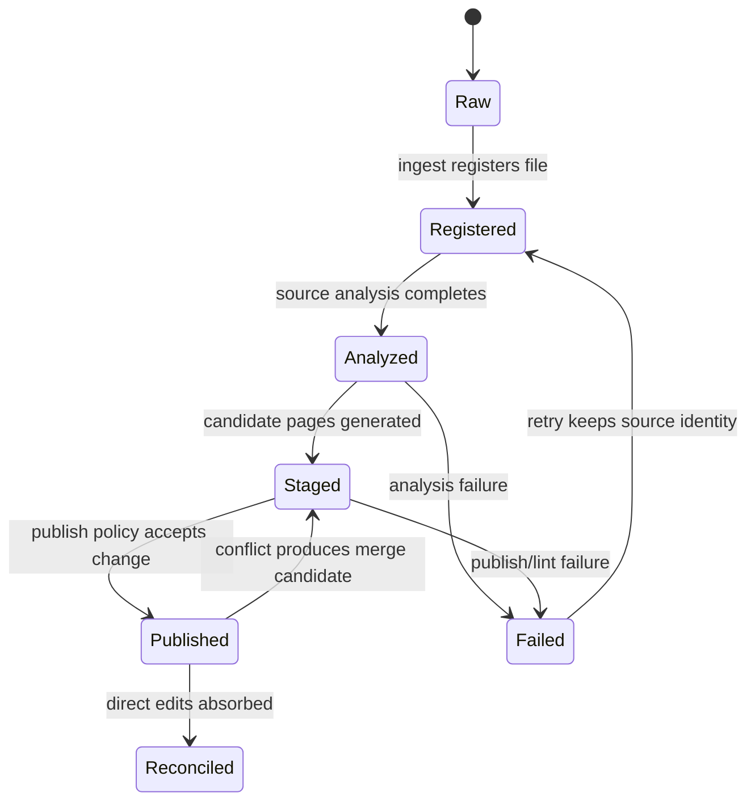
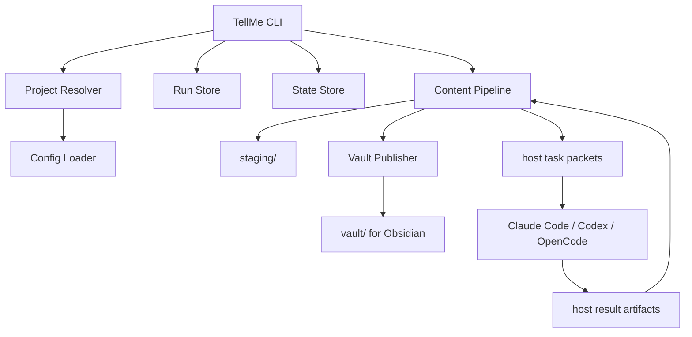

# TellMe Optimization Design

## Human Review Summary

- What We Are Building:
  - A clearer operating design for turning the current TellMe skeleton into a reliable local orchestrator: command behavior, project discovery, state transitions, run audit records, host handoff packets, and safe publishing boundaries.
- Why This Design:
  - The current repository has a Python CLI skeleton and basic JSON-backed `state/runs` models, but the next implementation phase would otherwise have to invent important behavior command by command.
- Human Approval Needed For:
  - The command interaction contract, the state model boundaries, the `runs/` audit shape, and the decision that host adapters exchange file-backed task packets rather than direct model-provider APIs in the near term.

## Problem Frame

TellMe has an approved high-level architecture: Python core, Obsidian display vault, multi-host entry through Claude Code, Codex, and OpenCode, plus a formal `reconcile` command. The current implementation proves only the CLI surface and minimal persistence. The next design problem is to make the operator-visible behavior and persistent boundaries explicit enough that implementation can proceed without drifting into either a pure skill package or a full model-provider runtime.

## Design Scope

- Owner Mode: engineering-led
- Design Focus: command flows, persistent state boundaries, run audit semantics, host adapter handoff behavior, publish/reconcile failure handling

Out of scope for this design:

- Exact implementation file sequencing
- Concrete model-provider SDK integration
- Full prompt wording for each host
- Advanced semantic search or vector indexing
- Obsidian plugin development

## Design Goals

- Make every TellMe command auditable through `runs/` even when execution fails partway.
- Preserve the hard boundary that `raw/` is immutable and `vault/` is a published display surface.
- Allow hosts to assist with LLM work without becoming the source of truth.
- Keep the first product iteration file-backed and debuggable before introducing databases, daemons, or model APIs.
- Make cross-platform operation predictable through project discovery and machine path resolution.

## Requirements Trace

- R1. TellMe must run on PC and MacBook through configurable paths.
- R2. TellMe must support Claude Code, Codex, and OpenCode as host entry points.
- R3. Obsidian must remain the display layer, not the system database.
- R4. The MVP command surface is `init`, `ingest`, `compile`, `query`, `lint`, and `reconcile`.
- R5. Direct host edits to `vault/` are allowed but must be recoverable through `reconcile`.
- R6. Low-risk changes may publish directly; higher-risk changes must stage first.
- R7. System state and operation history must be explicit and reviewable.

## Flow

### Command Lifecycle

Each command follows the same outer lifecycle, regardless of command-specific behavior:



### Content Lifecycle

Content state remains the system's central abstraction:



## Interaction Model

| Actor | Action | System Response | Notes |
|---|---|---|---|
| Operator | `tellme init <path>` | Creates project layout, config, state manifest, host adapter placeholders, and machine mapping | Must be idempotent and must not overwrite existing user config silently |
| Operator or host | `tellme ingest <source>` | Copies or registers source under `raw/`, records source hash, creates run audit | First optimization target after init |
| Operator or host | `tellme compile` | Produces candidate page updates and applies publish policy | Actual LLM synthesis can be delegated through host task packets |
| Operator or host | `tellme query "<question>"` | Reads published wiki context, creates an answer artifact, optionally stages writeback | Query writeback is not auto-published by default |
| Operator or host | `tellme lint` | Reports structural health and optionally stages safe fixes | Lint should be useful without any LLM |
| Operator or host | `tellme reconcile` | Scans vault changes, updates state, and stages conflict candidates | Must never silently discard human edits |
| Claude Code / Codex / OpenCode | Executes task packet | Writes declared output artifact and marks host result | Host output is input to TellMe, not final state by itself |

## States And Failure Handling

| State | Trigger | User / Operator Visible Behavior | Recovery Or Next Step |
|---|---|---|---|
| No Project | Command run outside project without explicit path | Clear error explaining how to pass `--project` or run `tellme init` | Operator chooses project root |
| Config Missing | Project exists but required config is absent | Command fails before content mutation; run records config error if possible | Run `tellme init --adopt` or repair config |
| Run Running | Command starts | `runs/<run-id>/run.json` appears immediately | If interrupted, future status can show orphaned running run |
| Source Registered | Ingest records source hash | Source appears in manifest with status `registered` | Compile can proceed |
| Analysis Failed | Host/model/source read fails | Source stays registered or failed with diagnostic | Retry ingest/compile after fixing cause |
| Candidate Staged | Compile creates page candidate | Candidate is visible in `staging/` and linked to run id | Publish, edit, or reject later |
| Published | Candidate passes publish policy | Page appears under `vault/` with required frontmatter | Obsidian displays it |
| Drift Detected | Vault hash differs from state | Reconcile report explains changed pages | Accept human edits, stage merge candidate, or mark intentional |
| Conflict | System candidate and human edit overlap | Human version remains published; merge candidate goes to `staging/` | Review and publish explicitly |
| Partial Failure | Some items succeed and some fail | Run ends with failure/partial status and per-item diagnostics | Retry only failed items |

## Interfaces And Boundaries

| Surface Or Component | Responsibility | Explicit Non-Responsibility |
|---|---|---|
| CLI | Operator-facing command contract, argument validation, exit codes, high-level reporting | Performing LLM synthesis directly in the near-term design |
| Project Resolver | Find project root and machine config | Guessing remote vault locations or mutating unrelated directories |
| Config Loader | Merge project, machine, host, and policy settings | Storing runtime status |
| State Store | Persist source/page/link/index metadata | Storing long logs, transcripts, or raw LLM outputs |
| Run Store | Persist audit trail for command executions | Acting as the current manifest |
| Staging Area | Hold candidates, conflicts, and reviewable writebacks | Displaying canonical published knowledge |
| Vault Publisher | Move approved content into Obsidian-facing `vault/` | Resolving human conflicts silently |
| Host Adapter | Create and consume host task/result artifacts | Owning project truth or bypassing TellMe state |
| Obsidian Vault | Display published markdown | Acting as a database or workflow engine |



## Command Behavior Design

### `init`

`init` remains idempotent. It creates missing structure and config, but does not overwrite existing files unless the operator chooses an explicit replacement/adopt mode. It should be able to initialize a new TellMe project or adopt a manually created directory that already contains `raw/` or `vault/`.

### `ingest`

`ingest` is responsible for source registration, not deep synthesis. It must establish source identity, source type, hash, immutable raw location, and traceability. If the input is outside `raw/`, TellMe should either copy it into `raw/` or register it by policy. The default design favors copying into `raw/` so the project remains portable.

### `compile`

`compile` converts registered/analyzed sources into candidate page updates. In the near term, host-assisted LLM work should happen through explicit task packets under `runs/<run-id>/host-tasks/`. TellMe then consumes host results and decides whether to stage or publish. This prevents host output from bypassing audit and publish policy.

### `query`

`query` reads published wiki content first. It may write an answer artifact to `runs/` and may stage a reusable answer under `staging/queries/`. Query writeback is not automatically published by default because query answers often include synthesis that deserves review.

### `lint`

`lint` should provide immediate value without any LLM: missing frontmatter, broken wikilinks, orphan pages, index drift, stale hashes, missing sources, and running-run leftovers. LLM-assisted contradiction detection is a later extension, not a requirement for the first useful lint.

### `reconcile`

`reconcile` compares `vault/` against known page records. It updates state for benign drift, records intentional human edits when detectable, and stages merge candidates for conflicts. Reconcile is forbidden from silently overwriting published human edits.

## Host Adapter Design

Host adapters use file-backed task/result exchange first.

### Task Packet

A host task packet should include:

- command and run id
- host target
- allowed read/write roots
- source files or page candidates to inspect
- expected output artifact
- publish constraints
- failure reporting format

### Result Artifact

A host result artifact should include:

- status
- generated or modified content path
- source references used
- confidence/risk note
- host/model identity when available
- errors or unresolved questions

This design keeps TellMe host-agnostic while still allowing host-specific strengths.

## State Model Design

The current `manifest.json` can remain file-backed for the next phase. It should evolve from the current minimal shape into a clearer schema:

| Section | Purpose |
|---|---|
| `sources` | Raw source identity, type, hash, lifecycle status, registration run |
| `pages` | Published/staged page identity, hash, page type, sources, last host, last run |
| `links` | Wikilink graph cache for lint and reconcile |
| `indexes` | Generated index metadata and drift status |
| `schema_version` | Migration control |

Design preference: stay JSON-backed until the manifest becomes too large or concurrent write pressure appears. SQLite is deferred, not rejected.

## Run Model Design

Each run should be a directory, not just one JSON file:

```text
runs/<run-id>/
├── run.json
├── input.json
├── diagnostics.md
├── host-tasks/
└── artifacts/
```

The visible state of the run is in `run.json`. Larger inputs, diagnostics, and generated artifacts live alongside it so they remain inspectable without inflating the manifest.

Run statuses should support:

- `running`
- `succeeded`
- `failed`
- `partial`
- `cancelled`

The current code only has `running`, `succeeded`, and `failed`; this is acceptable for the skeleton but insufficient for real ingest/compile.

## Key Design Decisions

- File-backed task exchange before direct model-provider APIs: This keeps Claude Code, Codex, and OpenCode equally viable and avoids prematurely choosing a provider abstraction.
- JSON manifest before SQLite: This preserves transparency while state size is small and makes design debugging easier.
- `runs/` as directories: This supports auditability, diagnostics, and host handoff without turning manifest into a log dump.
- Query writeback staged by default: This prevents conversational synthesis from silently becoming canonical knowledge.
- Lint starts static: Static lint creates immediate value and reduces dependency on LLM availability.
- Reconcile preserves human edits: This matches the approved hard constraint and makes direct Obsidian/host edits safe.

## Operational Considerations

- Project root discovery must be deterministic; if multiple roots are possible, fail with a clear message instead of guessing.
- Commands that mutate state should create the run record before mutation so interruption is auditable.
- Writes to manifest and run records should be atomic enough to survive interruption.
- Host tasks should declare allowed write roots to prevent accidental raw-source mutation.
- Mac/Windows path differences should be resolved at config load time; stored manifest paths should remain project-relative POSIX paths.
- A future lock file may be needed before parallel host execution is safe.

## Human Review Checklist

- The intended behavior is understandable without chat context: yes
- User/operator interactions are explicit: yes
- Important states and failures are explicit: yes
- Boundaries and non-goals are explicit: yes
- Remaining decisions are listed in the right section: yes
- Diagrams/tables are used where they materially improve reviewability: yes

## Open Questions

### Resolve Before Planning

- Resolved: `ingest` first implementation copies external files into `raw/` by default. Linked external sources are deferred.
- Resolved: `compile` first implementation may auto-publish low-risk source summary pages only when source attribution is complete and static lint passes. Concept, entity, query, and synthesis pages stage by default.
- Resolved: host task/result exchange first implementation uses JSON task packets under `runs/<run-id>/host-tasks/` and JSON result artifacts under `runs/<run-id>/artifacts/`.

### Deferred To Planning

- Exact Python module boundaries for resolver, config loader, pipeline, publisher, and host adapters
- Exact test breakdown and order
- Whether to add a lightweight file lock in the first implementation batch
- Naming convention for page directories under `vault/`

## Design Quality Gate

- Flow clarity: strong
- State completeness: strong
- Boundary clarity: strong
- User or operator clarity: strong
- Operability realism: strong
- Ambiguity left for implementer: acceptable

## Challenge Decision

- Challenge Mode: design
- Human approval readiness: ready_for_human_approval_after_challenge
- Must fix before human design approval: none known before challenge
- Challenge Summary Path: `docs/challenges/2026-04-10-tellme-optimization-design-challenge.md`
- Challenge Disposition Path: `docs/challenges/2026-04-10-tellme-optimization-design-disposition.md`

## Next Step

- Run `cmon:challenge(mode=design)`.
- After challenge passes, capture human design approval.
- Only then move to `cmon:plan`.
